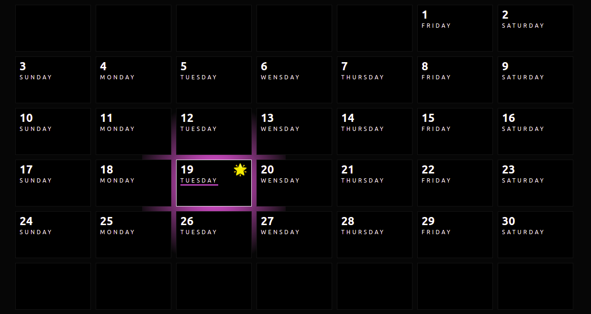

## Cool Calendar

A calendar that show each day with an effect in hover and mark the present day with 🌟.

You can do.

`npm install`

and run in local with

`npm run dev`

Open [http://localhost:3000](http://localhost:3000) to view it in your browser.

#### Personal note

Like how to calculate the distribution of each day.
